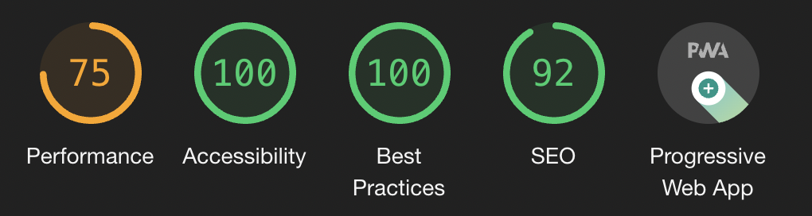
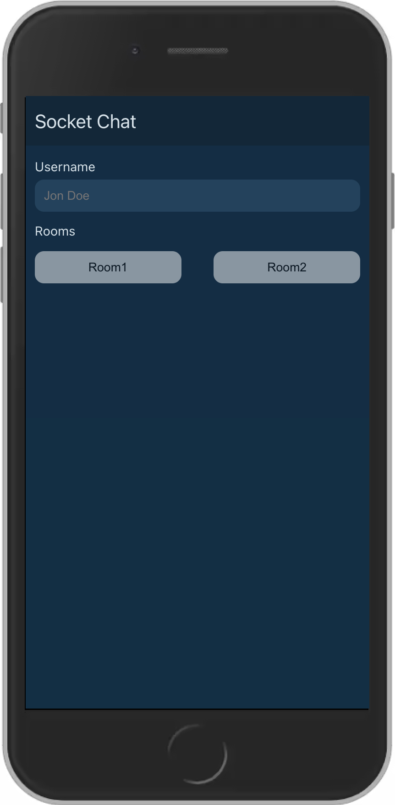
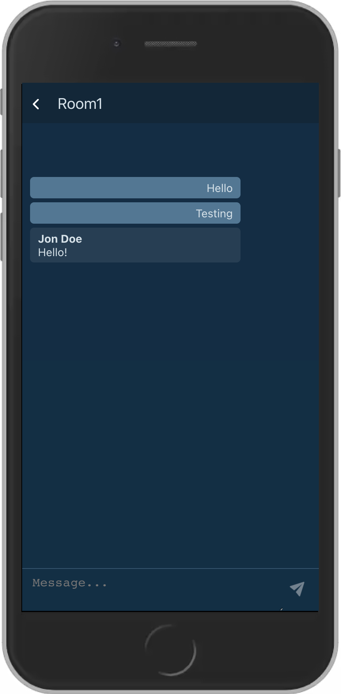

<div id="top"></div>

[![LinkedIn][linkedin-shield]][linkedin-url]

<!-- PROJECT LOGO -->
<br />
<div align="center">
  <a href="https://github.com/mocca-dev/socket-chat.git">
    
  </a>

<h3 align="center">ReactChat</h3>

  <p align="center">
    This is a simple React chat app to practice this type of interview excercises. 
    <br />
    <a href="https://socketchat.surge.sh/">View Demo</a>
  </p>
</div>

<div align="center">
  
</div>
<br>

<!-- TABLE OF CONTENTS -->
<details>
  <summary>Table of Contents</summary>
  <ol>
    <li>
      <a href="#about-the-project">About The Project</a>
      <ul>
        <li><a href="#built-with">Built With</a></li>
      </ul>
    </li>
    <li>
      <a href="#getting-started">Getting Started</a>
      <ul>
        <li><a href="#prerequisites">Installation and Startup</a></li>
      </ul>
    </li>
    <li><a href="#usage">Usage</a>
      <ul>
        <li><a href="#prerequisites">Load and play</a></li>
        <li><a href="#prerequisites">Settings</a></li>
      </ul>
    </li>
    <li><a href="#license">License</a></li>
    <li><a href="#contact">Contact</a></li>
  </ol>
</details>


<!-- ABOUT THE PROJECT -->
## About The Project
<div align="center">
  
</div>
<br>
<br>
<p>
  This is a simple chat app made with WebSocket API. Here I tried to practice react hooks and the communication with sockets. 
</p>
<p align="right">(<a href="#top">back to top</a>)</p>


### Built With

* [React.js](https://reactjs.org/)
* [WebSockets](https://developer.mozilla.org/en-US/docs/Web/API/WebSockets_API)
* [StyledComponents <💅>](https://styled-components.com/)

<p align="right">(<a href="#top">back to top</a>)</p>


<!-- GETTING STARTED -->
## Getting Started

This app is made with create-react-app so the installation process is simple.

### Installation and Startup (Client side)

1. Clone the repo
   ```sh
   git clone https://github.com/mocca-dev/socket-chat.git
   ```
2. Go to the chat app folder
   ```sh
   cd chat
   ```
3. Install NPM packages
   ```sh
   npm install
   ```
4. Finally you have to simply run the app and you're ready to go with the client.
   ```sh
   npm start
   ```
### Installation and Startup (Server side)

1. Go back to the main folder
   ```sh
   cd ..
   ```
2. Install NPM packages
   ```sh
   npm install
   ```
3. Finally you have to simply run the server and you're ready to go. Enjoy!
   ```sh
   node server.js
   ```

<p align="right">(<a href="#top">back to top</a>)</p>


<!-- USAGE EXAMPLES -->
## Usage

### Home

It's very straightfoward, just enter your username and choose a room.

### Chat room

<div align="center">
  
</div>
<br>
Write some message and hit enter or click in the send button.
<p align="right">(<a href="#top">back to top</a>)</p>


<!-- LICENSE -->
## License

Distributed under the MIT License. See `LICENSE.txt` for more information.

<p align="right">(<a href="#top">back to top</a>)</p>


<!-- CONTACT -->
## Contact

Nicolás Tonelli - nicolastonelli1406@gmail.com

Project Link: [https://github.com/mocca-dev/socket-chat.git](https://github.com/mocca-dev/socket-chat.git)

<p align="right">(<a href="#top">back to top</a>)</p>


<!-- MARKDOWN LINKS & IMAGES -->
<!-- https://www.markdownguide.org/basic-syntax/#reference-style-links -->
[contributors-shield]: https://img.shields.io/github/contributors/github_username/repo_name.svg?style=for-the-badge
[contributors-url]: https://github.com/github_username/repo_name/graphs/contributors
[forks-shield]: https://img.shields.io/github/forks/github_username/repo_name.svg?style=for-the-badge
[forks-url]: https://github.com/github_username/repo_name/network/members
[stars-shield]: https://img.shields.io/github/stars/github_username/repo_name.svg?style=for-the-badge
[stars-url]: https://github.com/github_username/repo_name/stargazers
[issues-shield]: https://img.shields.io/github/issues/github_username/repo_name.svg?style=for-the-badge
[issues-url]: https://github.com/github_username/repo_name/issues
[license-shield]: https://img.shields.io/github/license/github_username/repo_name.svg?style=for-the-badge
[license-url]: https://github.com/github_username/repo_name/blob/master/LICENSE.txt
[linkedin-shield]: https://img.shields.io/badge/-LinkedIn-black.svg?style=for-the-badge&logo=linkedin&colorB=555
[linkedin-url]: https://linkedin.com/in//nicolás-tonelli-181624b9/
[product-screenshot]: images/screenshot.png